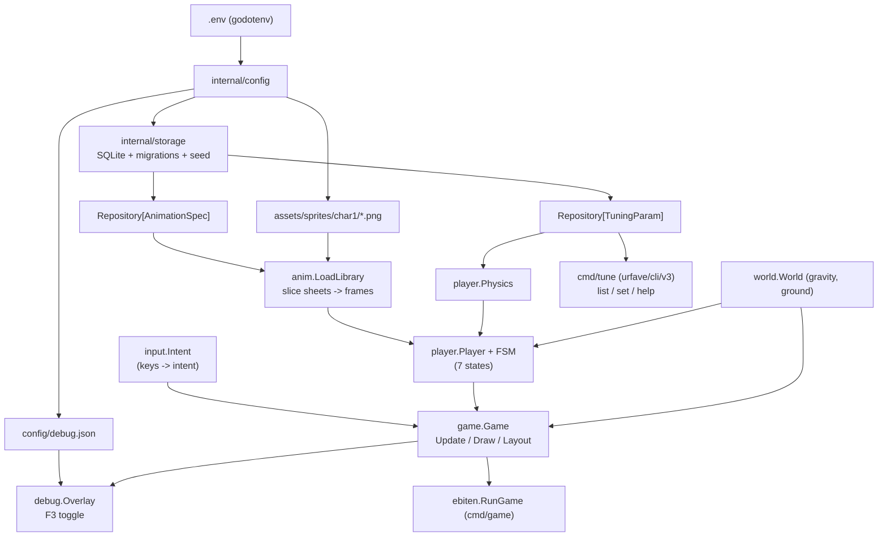
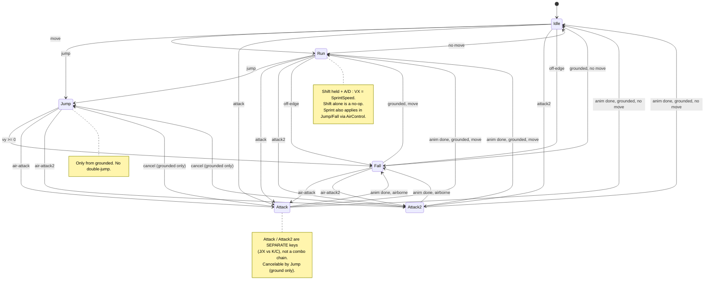

# Char1 Controller — Design Spec

**Date:** 2026-04-21 (updated 2026-04-23)
**Status:** Approved; updated after T16 smoke-test feedback

> **2026-04-23 revision.** The original design had a `Dash` state with an edge-triggered `Shift` burst and an air-dash budget. After playtesting (T16 smoke test) the mechanic was replaced with a **held sprint modifier**: `Shift` held together with `A`/`D` raises VX to `SprintSpeed`; pressing `Shift` alone is a no-op. `StateDash`, `HasAirDash`, `DashTimer`, `DashDuration`, and the dash override in `ApplyPhysics` are all removed. Sections below describe the current (sprint) design; historical migrations 001–004 still seed the original dash rows, and migrations 005/006 rename `dash_speed` → `sprint_speed` and tune it to 420 px/s (≈1.5× `run_speed`). The `_Dash.png` sheet is still loaded from DB but is currently unbound to any state (reserved for a future real-dash ability).
**Scope:** First playable demo: a single character (`char1`) with 7 animations, a keyboard-driven state machine, gravity + flat ground, tunable physics via SQLite, and a config-driven debug overlay.

---

## 1. Goals & Non-goals

### Goals
- Render `char1` sprite sheets from `assets/sprites/char1/*.png` using [ebiten v2](https://github.com/hajimehoshi/ebiten).
- Slice each horizontal strip into individual frames using a configurable frame size.
- Drive the character through a **state machine** over 6 states (Idle, Run, Jump, Fall, Attack, Attack2) with "responsive fighter" transition rules (attack cancelable by jump (grounded), Shift-held sprint modifier, no double-jump).
- Keyboard controls with both WASD+JKL and Arrows+Space/Shift/X/C accepted.
- Simple mock world: gray background, gray ground slab, gravity pulling the character down to the ground line.
- Animation library and physics tuning values live in **SQLite**, loaded at boot.
- Small **CLI** (`cmd/tune`, `urfave/cli/v3`) to update tuning values (update-only, validated against min/max).
- **Debug overlay** toggled with F3; which fields appear is driven by a JSON config file.
- All operational paths (DB path, assets dir, frame size, window size, debug config path) are configured via `.env` (loaded by `godotenv`); missing env keys panic at boot.

### Non-goals (this iteration)
- Enemies, collisions other than ground, hitboxes.
- Additional animations beyond the 7 listed in `plan-animation.md` (the library is designed so that adding a row to the seed migration is enough).
- Sound, UI, menus, save/load, level design.
- Hot reload of `debug.json` or tuning changes (tuning changes require game restart; deliberate YAGNI).

---

## 2. Animation inventory (from `plan-animation.md`)

All sheets are horizontal strips, frame size **120 × 80 px** (folder is named `120x80_PNGSheets` and each width matches `FrameCount × 120`, height 80). Frame size is NOT hard-coded — it comes from env.

| Animation | Frames | Duration | Loop | File |
|---|---|---|---|---|
| Idle | 10 | 1.0 s | yes | `_Idle.png` |
| Run | 10 | 1.0 s | yes | `_Run.png` |
| Jump | 3 | 0.5 s | no | `_Jump.png` |
| Fall | 3 | 0.5 s | no (clamp last frame) | `_Fall.png` |
| Dash | 2 | 0.5 s | no | `_Dash.png` (loaded but unbound — see 2026-04-23 revision) |
| Attack | 4 | 0.5 s | no | `_Attack.png` |
| Attack2 | 6 | 0.75 s | no | `_Attack2.png` |

Frame duration = `Duration / FrameCount` (uniform). Non-loop animations clamp on the final frame when elapsed ≥ duration and signal `Done()`.

---

## 3. Architecture overview

```
claude-pixel/
├── .env                          # runtime config, committed
├── .env.example                  # template
├── cmd/
│   ├── game/main.go              # ebiten entry point
│   └── tune/main.go              # CLI entry point (urfave/cli/v3)
├── config/
│   └── debug.json                # debug overlay layout, committed
├── data/
│   └── game.db                   # SQLite, git-ignored, regenerable from migrations
├── docs/
│   └── superpowers/specs/…
├── assets/
│   └── sprites/char1/*.png
└── internal/
    ├── config/                   # godotenv loader, Config struct, mustString/mustInt
    ├── storage/
    │   ├── sqlite.go             # Open + migrate + seed
    │   ├── migrations/           # embedded *.sql files
    │   └── repository.go         # generic Repository[T] + Mapper[T]
    ├── anim/
    │   ├── spec.go               # AnimationSpec + Mapper
    │   ├── sheet.go              # frame slicing
    │   ├── animation.go          # runtime Animation (elapsed, Update, Frame, Done, Reset)
    │   └── library.go            # LoadLibrary (PNG -> frames)
    ├── input/
    │   └── input.go              # Poll() -> Intent
    ├── player/
    │   ├── player.go             # struct Player
    │   ├── physics.go            # struct Physics + LoadPhysics(repo)
    │   ├── tuning.go             # TuningParam + Mapper
    │   ├── fsm.go                # FSM, State interface
    │   └── states.go             # idleState, runState, …, attack2State
    ├── world/
    │   └── world.go              # World: Gravity, GroundY
    ├── debug/
    │   ├── fields.go             # Field catalog + FieldSource interface
    │   ├── config.go             # LoadConfig + JSON validation
    │   └── overlay.go            # Overlay struct, Toggle, Draw
    └── game/
        └── game.go               # ebiten.Game: Update/Draw/Layout
```

### Module dependency diagram



---

## 4. Config (`internal/config`)

### `.env` (committed)

```
# storage & assets
DB_PATH=./data/game.db
ASSETS_DIR=./assets/sprites/char1

# sprite frame size (per-frame in a horizontal strip)
SPRITE_FRAME_W=120
SPRITE_FRAME_H=80

# window & render
WINDOW_WIDTH=1280
WINDOW_HEIGHT=720
RENDER_SCALE=3

# debug overlay
DEBUG_CONFIG_PATH=./config/debug.json
```

### Contract

```go
type Config struct {
    DBPath          string
    AssetsDir       string
    SpriteFrameW    int
    SpriteFrameH    int
    WindowW         int
    WindowH         int
    RenderScale     int
    DebugConfigPath string
}

// Load reads .env via godotenv.Load (non-fatal if file missing — env may already be set)
// then reads each key via os.Getenv. Missing or unparseable keys panic with the key name.
func Load() *Config
```

No default values in code. `.env` ships the defaults.

---

## 5. Storage layer (`internal/storage`)

### Driver

`modernc.org/sqlite` (pure Go, no CGO). Chosen so Windows users do not need a C toolchain. Interface is `database/sql`, so swapping to `mattn/go-sqlite3` later is a one-line change with no ripple.

### Generic repository

```go
type Entity interface {
    GetID() string
}

type Scanner interface {
    Scan(dest ...any) error
}

type Mapper[T Entity] interface {
    Table() string
    Columns() []string              // column order for SELECT / INSERT / UPDATE
    Scan(row Scanner) (T, error)    // row -> T
    Values(t T) []any               // T -> values in Columns() order
}

type Repository[T Entity] struct {
    db     *sql.DB
    mapper Mapper[T]
}

func NewRepository[T Entity](db *sql.DB, m Mapper[T]) *Repository[T]

func (r *Repository[T]) Get(ctx context.Context, id string) (T, error)
func (r *Repository[T]) List(ctx context.Context) ([]T, error)
func (r *Repository[T]) Upsert(ctx context.Context, t T) error   // INSERT … ON CONFLICT(id) DO UPDATE
func (r *Repository[T]) Delete(ctx context.Context, id string) error
```

The `Upsert` SQL is built from `mapper.Table()`, `mapper.Columns()`, and the first column (ID) used as the conflict target.

### Migrations

SQL files embedded via `embed.FS` under `internal/storage/migrations/`. Applied in lexical order, tracked in a `schema_migrations` table (`version TEXT PRIMARY KEY, applied_at TIMESTAMP`). Each file runs inside a transaction.

```
001_init_animations.sql       -- CREATE TABLE animations
002_seed_char1_animations.sql -- INSERT the 7 rows
003_init_tuning.sql           -- CREATE TABLE tuning
004_seed_tuning.sql           -- INSERT the 7 rows
```

### Boot sequence

```go
func Open(cfg *config.Config) (*sql.DB, error)   // returns err on failure
func MustOpen(cfg *config.Config) *sql.DB        // convenience wrapper; panics on err (used by cmd/game and cmd/tune)
```

1. Ensure directory of `cfg.DBPath` exists (`os.MkdirAll`).
2. `sql.Open("sqlite", cfg.DBPath)` and `db.Ping()`.
3. Apply pending migrations.
4. Return `*sql.DB`.

Seeds live inside migrations (`INSERT OR IGNORE` style). After migrations apply once, subsequent boots are no-ops.

---

## 6. Animation system (`internal/anim`)

### SQL schema (`001_init_animations.sql`)

```sql
CREATE TABLE animations (
    id           TEXT    PRIMARY KEY,
    file         TEXT    NOT NULL,
    frame_count  INTEGER NOT NULL,
    duration_ms  INTEGER NOT NULL,
    loop         INTEGER NOT NULL
);
```

### Seed (`002_seed_char1_animations.sql`)

```sql
-- migration 002 (original seed, immutable)
INSERT OR IGNORE INTO animations (id, file, frame_count, duration_ms, loop) VALUES
    ('idle',    '_Idle.png',    10, 1000, 1),
    ('run',     '_Run.png',     10, 1000, 1),
    ('jump',    '_Jump.png',     3,  500, 0),
    ('fall',    '_Fall.png',     3,  500, 0),
    ('dash',    '_Dash.png',     2,  500, 0),   -- loaded but currently unbound
    ('attack',  '_Attack.png',   4, 1500, 0),
    ('attack2', '_Attack2.png',  6, 1500, 0);

-- migration 005 (tuning amendment): attack=500ms, attack2=750ms.
```

### Types

```go
type AnimationSpec struct {
    ID         string
    File       string
    FrameCount int
    DurationMs int
    Loop       bool
}
func (a AnimationSpec) GetID() string { return a.ID }

type Animation struct {  // runtime instance
    spec    *AnimationSpec
    frames  []*ebiten.Image
    elapsed time.Duration
}

func (a *Animation) Update(dt time.Duration)
func (a *Animation) CurrentFrame() *ebiten.Image
func (a *Animation) FrameIndex() int
func (a *Animation) Elapsed() time.Duration
func (a *Animation) SpecID() string
func (a *Animation) Done() bool    // true iff !spec.Loop && elapsed >= duration
func (a *Animation) Reset()
```

- Frame index = `int(elapsed / frameDuration)` where `frameDuration = DurationMs / FrameCount`.
- Non-loop: clamp index at `FrameCount - 1` when done.
- Loop: index `% FrameCount`.

### Slicing (`sheet.go`)

```go
func Slice(img *ebiten.Image, frameW, frameH, count int) []*ebiten.Image {
    frames := make([]*ebiten.Image, count)
    for i := 0; i < count; i++ {
        r := image.Rect(i*frameW, 0, (i+1)*frameW, frameH)
        frames[i] = img.SubImage(r).(*ebiten.Image)
    }
    return frames
}
```

`frameW` and `frameH` come from `cfg.SpriteFrameW/H` — no hard-coded 120/80 anywhere in `anim`.

### `LoadLibrary`

```go
func LoadLibrary(
    cfg *config.Config,
    repo *storage.Repository[AnimationSpec],
) (map[string]*Animation, error)
```

1. `specs, err := repo.List(ctx)`
2. For each spec: open `filepath.Join(cfg.AssetsDir, spec.File)`, decode PNG via `ebitenutil.NewImageFromFile` or `image.Decode` + `ebiten.NewImageFromImage`.
3. `Slice` into frames; build an `*Animation` keyed by `spec.ID`.
4. Return the map.

Errors (missing file, unreadable PNG, frame count mismatch) surface immediately — fail fast.

---

## 7. Player + state machine (`internal/player`)

### State machine diagram



### Per-state contract

| State | Animation | VX | Physics | Exit conditions |
|---|---|---|---|---|
| Idle | Idle (loop) | 0 | gravity on, stick to ground | move → Run / off-edge → Fall / jump/attack/attack2 |
| Run | Run (loop) | ±(SprintHeld ? SprintSpeed : RunSpeed) | gravity on | no move → Idle / off-edge → Fall / jump/attack/attack2 |
| Jump | Jump (non-loop) | ±(SprintHeld ? SprintSpeed : RunSpeed) × AirControl | gravity on (after impulse) | vy ≥ 0 → Fall / attack (cancel) |
| Fall | Fall (clamp last frame) | ±(SprintHeld ? SprintSpeed : RunSpeed) × AirControl | gravity on | grounded → Idle/Run / attack |
| Attack | Attack (non-loop) | 0 on ground; preserved on air | gravity on | anim.Done → Idle/Run/Fall / jump cancel (ground) |
| Attack2 | Attack2 (non-loop) | same as Attack | gravity on | anim.Done → Idle/Run/Fall / jump cancel (ground) |

### Additional invariants

- **No double-jump.** Jump input only consumed when `grounded == true`.
- **Sprint modifier:** `Shift` is held-state (`IsKeyPressed`), not edge-triggered. While `SprintHeld && moveDir != 0`, horizontal speed becomes `SprintSpeed` instead of `RunSpeed`. Pressing `Shift` without a direction is a no-op — the player stays in Idle (or the current state) and VX stays 0. Sprint is always available (no budget, no cooldown) both on ground and in air (air multiplies by `AirControl`).
- **Facing:** Updated whenever `Left` or `Right` intent is held (last pressed wins).
- **Attack cancel to Jump on ground only** — in the air there is no meaningful "jump cancel" (character is already airborne).
- **Off-edge detection:** `Y >= GroundY` means grounded. If `Grounded == true` and a horizontal step would not land on ground (future-proof: today ground is a full slab, so this never happens; keeping the transition for completeness).

### FSM implementation

```go
type StateID string

const (
    StateIdle    StateID = "idle"
    StateRun     StateID = "run"
    StateJump    StateID = "jump"
    StateFall    StateID = "fall"
    StateAttack  StateID = "attack"
    StateAttack2 StateID = "attack2"
)

type State interface {
    ID() StateID
    Enter(p *Player)
    Update(p *Player, in input.Intent, dt time.Duration) StateID
    Exit(p *Player)
}

type FSM struct {
    states  map[StateID]State
    current State
}

func NewFSM(initial StateID) *FSM
func (f *FSM) CurrentID() StateID
func (f *FSM) Handle(p *Player, in input.Intent, dt time.Duration)
```

Each state is a small struct in `states.go`. Cancel rules are encoded in each state's `Update` (e.g. `attackState.Update` checks `in.JumpPressed` while grounded before defaulting to animation-driven exit). Sprint speed selection is centralized in `groundSpeed` / `airSpeed` helpers that Run/Jump/Fall call when computing VX.

### `Player`

```go
type Player struct {
    X, Y     float64   // feet position in world space
    VX, VY   float64
    Facing   int       // +1 or -1
    Grounded bool
    FSM      *FSM
    Physics  *Physics
    Anims    map[string]*Animation
    Current  *Animation   // pointer into Anims
}

func (p *Player) PlayAnim(id string)                       // Reset + set Current
func (p *Player) ApplyPhysics(w *world.World, dt time.Duration)
```

---

## 8. Physics tuning (`internal/player`)

### SQL schema (`003_init_tuning.sql`)

```sql
CREATE TABLE tuning (
    key         TEXT    PRIMARY KEY,
    value       REAL    NOT NULL,
    min_value   REAL    NOT NULL,
    max_value   REAL    NOT NULL,
    unit        TEXT    NOT NULL DEFAULT '',
    description TEXT    NOT NULL
);
```

### Seed (`004_seed_tuning.sql` + `005_sprint_and_attack_tuning.sql` + `006_tune_sprint_speed.sql`)

Migration 004 is immutable (already applied); 005/006 amend it. The effective state after all migrations run is:

```sql
-- effective rows in `tuning`
key               value   min     max    unit      description
run_speed         280      50    1000   px/s      Horizontal ground movement speed
air_control       0.8       0       1             Horizontal movement multiplier while airborne
jump_velocity    -650   -2000    -100   px/s      Jump impulse applied on takeoff (negative = upward)
gravity          2000     100    5000   px/s^2    Downward acceleration applied each tick
max_fall_speed    900     100    3000   px/s      Terminal vertical velocity clamp
sprint_speed      420     100    2000   px/s      Horizontal ground movement speed while Shift held
```

Migration 005 also updates `animations.duration_ms` to `attack=500` and `attack2=750` for snappier combat feel, renames `dash_speed` → `sprint_speed`, and deletes the obsolete `dash_duration_ms` row. Migration 006 tunes `sprint_speed` to `420` (≈1.5× `run_speed`).

### Types

```go
type TuningParam struct {
    Key         string
    Value       float64
    MinValue    float64
    MaxValue    float64
    Unit        string
    Description string
}
func (t TuningParam) GetID() string { return t.Key }

type Physics struct {
    RunSpeed     float64
    AirControl   float64
    JumpVelocity float64
    Gravity      float64
    MaxFallSpeed float64
    SprintSpeed  float64
}

func LoadPhysics(repo *storage.Repository[TuningParam]) (*Physics, error)
```

`LoadPhysics` fetches all rows and errors if any of the six expected keys is missing.

---

## 9. Input (`internal/input`)

### `Intent`

```go
type Intent struct {
    Left, Right    bool  // held
    JumpPressed    bool  // edge (just pressed this tick)
    SprintHeld     bool  // held
    AttackPressed  bool  // edge
    Attack2Pressed bool  // edge
}

func Poll() Intent
```

### Key map (fixed, not configurable in this iteration)

| Intent | Keys |
|---|---|
| Left | `A`, `ArrowLeft` (held) |
| Right | `D`, `ArrowRight` (held) |
| JumpPressed | `Space` (edge) |
| SprintHeld | `ShiftLeft` or `ShiftRight` (held) |
| AttackPressed | `J` or `X` (edge) |
| Attack2Pressed | `K` or `C` (edge) |

Edges use `inpututil.IsKeyJustPressed`; holds use `ebiten.IsKeyPressed`. The state machine only ever sees `Intent` — key remapping can later be added without touching FSM code.

---

## 10. World (`internal/world`)

```go
type World struct {
    Gravity float64   // copied from Physics.Gravity at boot
    GroundY float64   // GroundY = float64(cfg.WindowH) - 120 (for 1280x720 -> 600)
}
```

Flat slab from `y = GroundY` down to `cfg.WindowH`. No horizontal walls.

---

## 11. Debug overlay (`internal/debug`)

### Field catalog (`fields.go`)

```go
type FieldSource interface {
    Player() *player.Player
    Intent() *input.Intent
    EngineFPS() float64
    EngineTPS() float64
}

type Field struct {
    Key    string
    Format func(s FieldSource) string
}

var Catalog = map[string]Field{
    "state":           {"state",           func(s FieldSource) string { return "State: " + string(s.Player().FSM.CurrentID()) }},
    "facing":          {"facing",          func(s FieldSource) string { return fmt.Sprintf("Facing: %+d", s.Player().Facing) }},
    "grounded":        {"grounded",        func(s FieldSource) string { return fmt.Sprintf("Grounded: %t", s.Player().Grounded) }},
    "x":               {"x",               func(s FieldSource) string { return fmt.Sprintf("X: %.2f", s.Player().X) }},
    "y":               {"y",               func(s FieldSource) string { return fmt.Sprintf("Y: %.2f", s.Player().Y) }},
    "vx":              {"vx",              func(s FieldSource) string { return fmt.Sprintf("VX: %.2f", s.Player().VX) }},
    "vy":              {"vy",              func(s FieldSource) string { return fmt.Sprintf("VY: %.2f", s.Player().VY) }},
    "anim_id":         {"anim_id",         func(s FieldSource) string { a := s.Player().Current; if a == nil { return "AnimID: -" }; return "AnimID: " + a.SpecID() }},
    "anim_frame":      {"anim_frame",      func(s FieldSource) string { a := s.Player().Current; if a == nil { return "Frame: -" }; return fmt.Sprintf("Frame: %d", a.FrameIndex()) }},
    "anim_elapsed_ms": {"anim_elapsed_ms", func(s FieldSource) string { a := s.Player().Current; if a == nil { return "Elapsed: -" }; return fmt.Sprintf("Elapsed: %d ms", a.Elapsed().Milliseconds()) }},
    "intent_left":     {"intent_left",     func(s FieldSource) string { return fmt.Sprintf("Left: %t", s.Intent().Left) }},
    "intent_right":    {"intent_right",    func(s FieldSource) string { return fmt.Sprintf("Right: %t", s.Intent().Right) }},
    "intent_jump":     {"intent_jump",     func(s FieldSource) string { return fmt.Sprintf("Jump: %t", s.Intent().JumpPressed) }},
    "intent_sprint":   {"intent_sprint",   func(s FieldSource) string { return fmt.Sprintf("Sprint: %t", s.Intent().SprintHeld) }},
    "intent_attack":   {"intent_attack",   func(s FieldSource) string { return fmt.Sprintf("Attack: %t", s.Intent().AttackPressed) }},
    "intent_attack2":  {"intent_attack2",  func(s FieldSource) string { return fmt.Sprintf("Attack2: %t", s.Intent().Attack2Pressed) }},
    "fps":             {"fps",             func(s FieldSource) string { return fmt.Sprintf("FPS: %.1f", s.EngineFPS()) }},
    "tps":             {"tps",             func(s FieldSource) string { return fmt.Sprintf("TPS: %.1f", s.EngineTPS()) }},
}
```

### `config/debug.json` (default, committed)

```json
{
  "sections": [
    { "title": "State",      "fields": ["state", "facing", "grounded"] },
    { "title": "Kinematics", "fields": ["x", "y", "vx", "vy"] },
    { "title": "Animation",  "fields": ["anim_id", "anim_frame", "anim_elapsed_ms"] },
    { "title": "Intent",     "fields": ["intent_left", "intent_right", "intent_jump", "intent_sprint", "intent_attack", "intent_attack2"] },
    { "title": "Engine",     "fields": ["fps", "tps"] }
  ]
}
```

### Contract

```go
type Section struct {
    Title  string   `json:"title"`
    Fields []string `json:"fields"`
}
type Config struct {
    Sections []Section `json:"sections"`
}

func LoadConfig(path string) (*Config, error)
// Validates every field referenced exists in Catalog.
// On any unknown field: return error listing unknowns and the full catalog of valid keys.

type Overlay struct {
    cfg     *Config
    source  FieldSource
    enabled bool
}

func New(cfg *Config, source FieldSource) *Overlay
func (o *Overlay) Toggle()                      // bound to F3 inside game.Game.Update
func (o *Overlay) Enabled() bool
func (o *Overlay) Draw(screen *ebiten.Image)    // iterates sections, renders "-- Title --" then fields
```

### Behavior

- Overlay is **off by default**.
- Toggle is handled in `game.Game.Update` via `inpututil.IsKeyJustPressed(ebiten.KeyF3)`.
- JSON loaded once at boot; invalid content causes panic (fail fast — this is a dev-only path).
- No hot-reload in this iteration. Adding a watcher later is a pure addition.

---

## 12. Game loop (`internal/game` + `cmd/game`)

### `ebiten.Game` methods

```go
type Game struct {
    cfg       *config.Config
    world     *world.World
    player    *player.Player
    overlay   *debug.Overlay
    lastIntent input.Intent
}

func (g *Game) Update() error
func (g *Game) Draw(screen *ebiten.Image)
func (g *Game) Layout(outerW, outerH int) (int, int) { return g.cfg.WindowW, g.cfg.WindowH }
```

### `Update()`

```
if F3 just pressed: overlay.Toggle()

intent := input.Poll()
g.lastIntent = intent
dt := time.Second / 60

g.player.FSM.Handle(g.player, intent, dt)
g.player.ApplyPhysics(g.world, dt)
g.player.Current.Update(dt)
return nil
```

### `Draw()`

1. Background: `screen.Fill(color.RGBA{0x80, 0x80, 0x80, 0xFF})`.
2. Ground slab: filled rect from `(0, GroundY)` to `(WindowW, WindowH)` in `color.RGBA{0x3A, 0x3A, 0x3A, 0xFF}`.
3. Player:
   ```
   op := &ebiten.DrawImageOptions{}
   op.GeoM.Translate(-float64(frameW)/2, -float64(frameH))   // feet at origin
   if player.Facing < 0 { op.GeoM.Scale(-1, 1) }
   op.GeoM.Scale(float64(cfg.RenderScale), float64(cfg.RenderScale))
   op.GeoM.Translate(player.X, player.Y)
   op.Filter = ebiten.FilterNearest
   screen.DrawImage(player.Current.CurrentFrame(), op)
   ```
4. Overlay: `g.overlay.Draw(screen)` (no-op if disabled).

### `cmd/game/main.go`

```go
func main() {
    cfg := config.Load()
    db := storage.MustOpen(cfg)
    defer db.Close()

    animRepo := storage.NewRepository[anim.AnimationSpec](db, anim.Mapper{})
    tuneRepo := storage.NewRepository[player.TuningParam](db, player.TuningMapper{})

    anims, err := anim.LoadLibrary(cfg, animRepo); must(err)
    physics, err := player.LoadPhysics(tuneRepo);  must(err)

    dbgCfg, err := debug.LoadConfig(cfg.DebugConfigPath); must(err)

    g := game.New(cfg, anims, physics, dbgCfg)

    ebiten.SetWindowSize(cfg.WindowW, cfg.WindowH)
    ebiten.SetWindowTitle("claude-pixel")
    must(ebiten.RunGame(g))
}
```

---

## 13. CLI (`cmd/tune`)

### Commands (`urfave/cli/v3`)

```
claude-pixel-tune
├── list                        List every tunable parameter
├── set <key> <value>           Update a single parameter (existing keys only)
└── help [command]              Auto-generated; `help set` lists all keys + ranges
```

### Behavior

- **Shares `cmd/tune`'s bootstrap with `cmd/game`:** loads `.env` via `config.Load`, opens DB via `storage.Open`, constructs `Repository[TuningParam]`. No game subsystems loaded.
- **`tune list`** — reads all rows via `repo.List`, prints a formatted table (key, value, min, max, unit, description). English labels.
- **`tune set <key> <value>`** —
  1. `repo.Get(key)` → error `unknown tuning key "<key>". Run "tune list" to see valid keys.` if row missing. **No create.**
  2. Parse `<value>` as `float64` → error on parse failure.
  3. Call `Validate(param, newValue)` (see below). Error format: `value out of range: <x> not in [<min>, <max>] <unit>`.
  4. `repo.Upsert` with updated `value`.
  5. Print `OK: <key> = <new> <unit> (was <old>)`.
- **Validation** lives in `internal/player/tuning_validator.go`, separate from CLI handler, so it can be reused from other entry points later:
  ```go
  // internal/player (same package as TuningParam)
  func ValidateTuning(p TuningParam, newValue float64) error
  ```

### Makefile additions

```makefile
run:
	go run ./cmd/game

tune:
	go run ./cmd/tune $(ARGS)       # usage: make tune ARGS="list" or ARGS="set run_speed 320"
```

---

## 14. Dependencies (`go.mod`)

- `github.com/hajimehoshi/ebiten/v2`
- `github.com/joho/godotenv`
- `modernc.org/sqlite`
- `github.com/urfave/cli/v3`

No CGO required.

---

## 15. Testing strategy

Unit-testable without ebiten:

- **`anim.Animation`** — pure math on `elapsed`, `FrameIndex`, `Done`. Table-driven tests for loop vs non-loop, exact boundaries.
- **`storage.Repository[T]`** — in-memory SQLite (`:memory:`) with a toy `Entity` + `Mapper`.
- **`player.FSM`** — all transitions can be driven by synthetic `Intent` sequences; no rendering needed.
- **`debug.LoadConfig`** — validates unknown fields are rejected with a useful error message.
- **`tuning.Validate`** — table-driven.

Ebiten-coupled code (`game.Draw`, `anim.Slice`, `Overlay.Draw`) is validated manually — run the binary, press each key, confirm animation + state transitions visually against the debug overlay.

---

## 16. Extensibility notes

- **New animation (e.g. Crouch, Roll):** add a row to `005_seed_extra_animations.sql` + (if it introduces new behavior) a new `State` struct in `internal/player/states.go` registered in the FSM map. No change to the animation runtime or loader.
- **New entity in DB:** define a `T` + a `Mapper[T]`, construct `storage.NewRepository[T]` — full CRUD for free.
- **New tuning parameter:** add a row to the seed migration; add a field to `Physics`; update `LoadPhysics`. CLI `list` and `help` pick up the new row automatically (data-driven).
- **New debug field:** register in `Catalog`; reference from `debug.json`.
- **Key remapping:** replace `input.Poll` internals while keeping `Intent` shape — FSM untouched.

---

## 17. Open questions / deferred

- Hot-reload of `debug.json` and tuning rows (currently restart required).
- Serialization of save state (e.g. player position) — no persistence of game state today.
- Sound, UI, multiple characters, enemies — explicitly out of scope.
